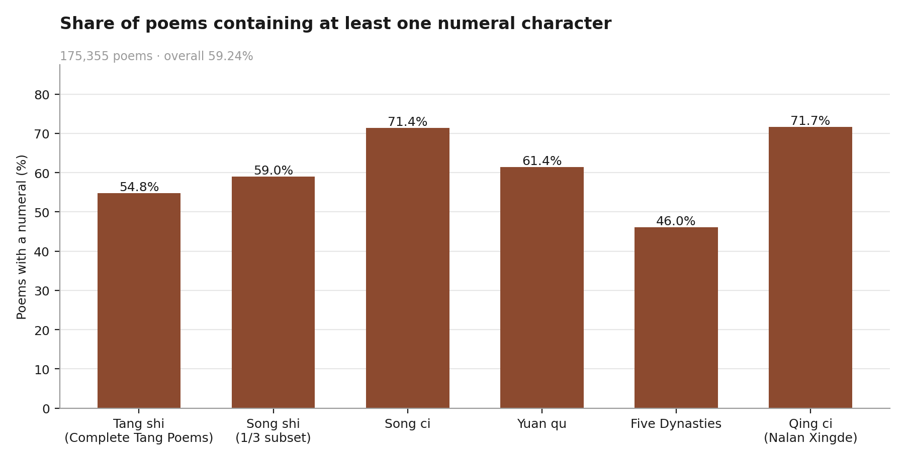
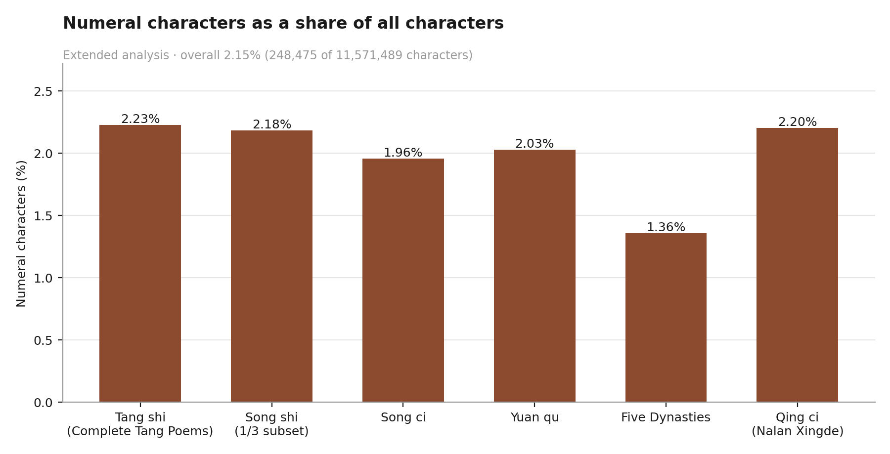

# Numbers in Chinese Poetry from the Tang Dynasty Onward

**Zizheng Lv**
ORCID: [0009-0004-0327-4477](https://orcid.org/0009-0004-0327-4477)
DOI: to be assigned (Zenodo archive of the v1.0.0 release)
Version 1.0.0 · [中文说明 / Chinese version](README_zh.md)

This project originates from a digital humanities research presentation conducted by Zizheng Lv during an exchange program at Peking University in July 2026. The corpus scan, the counting code and the analysis presented here are the author's own work. The repository reconstructs that analysis, releases the code and the derived statistics, and archives the presentation material.

---

## Research question

How often do numerals appear in classical Chinese poetry, and does that rate differ across periods and genres from the Tang dynasty to the Qing?

The starting point was a literary observation: numerals carry a great deal of weight in well-known poems — `三男邺城戍` in Du Fu's *Shi hao li*, `千山鸟飞绝，万径人踪灭` in Liu Zongyuan's *Jiang xue*, `对影成三人` in Li Bai's *Yue xia du zhuo*. The question is whether that impression survives contact with a large corpus, or whether it is an artifact of anthology selection.

## Corpus

175,355 poems drawn from the open-source [`chinese-poetry/chinese-poetry`](https://github.com/chinese-poetry/chinese-poetry) database (MIT licence):

| Collection | Period | Genre | Poems |
|---|---|---|---:|
| *Quan Tang shi* | Tang, 618–907 | shi | 57,603 |
| *Huajian ji* + Southern Tang | Five Dynasties, 907–979 | shi and ci | 543 |
| *Quan Song shi* (1/3 subset) | Song, 960–1279 | shi | 84,984 |
| *Quan Song ci* | Song, 960–1279 | ci | 21,053 |
| *Yuan qu* | Yuan, 1271–1368 | qu | 10,914 |
| Nalan Xingde, collected poems | Qing, 1644–1912 | ci | 258 |

The corpus itself is **not redistributed here**. See [`data/README.md`](data/README.md) for how to obtain it and verify that your copy matches the one used, via the SHA-256 manifest in [`results/corpus_manifest.json`](results/corpus_manifest.json).

## Method

A poem counts as containing a numeral if any of these characters appears in its text:

```
一 二 三 四 五 六 七 八 九 十 百 千 万 萬 亿 億 两 兩 零 廿 卅
```

The test is a set intersection, `set(text) & NUMERAL_CHARS`, cross-checked against a regular-expression match. **The unit of analysis is the poem**: a poem is counted once whether it contains one numeral or twenty.

Run it:

```bash
python3 src/numeral_scan.py --corpus /path/to/chinese-poetry --out results/
```

## Results

**59.24% of the 175,355 poems contain at least one numeral character** (103,885 poems).



| Collection | Poems | With a numeral | Rate |
|---|---:|---:|---:|
| Tang shi | 57,603 | 31,552 | 54.8% |
| Five Dynasties | 543 | 250 | 46.0% |
| Song shi (1/3 subset) | 84,984 | 50,171 | 59.0% |
| Song ci | 21,053 | 15,022 | 71.4% |
| Yuan qu | 10,914 | 6,705 | 61.4% |
| Qing ci (Nalan Xingde) | 258 | 185 | 71.7% |
| **Total** | **175,355** | **103,885** | **59.24%** |

Two patterns stand out. The *ci* collections sit at the top of the range (71.4% and 71.7%) while *shi* sits lower (54.8% and 59.0%), which suggests that genre separates the groups more sharply than period does. And `一` is the most frequent numeral in every single collection, by a wide margin — 20,277 occurrences in Tang shi against 9,024 for the runner-up `三`.

### Extended analysis (September 2026)

Two measurements were added while preparing this release; they were not part of the July 2026 presentation.

**Character-level rate.** Numerals make up **2.15% of all 11,571,489 characters** in the corpus, and the figure is remarkably flat across collections (1.36%–2.23%). The poem-level rate varies a great deal; the density of numerals within a text barely moves.



**Approximate and indefinite quantity words.** Adding `半 双 雙 几 幾 数 數 无 無` to the character set raises the poem-level rate from 59.24% to **73.4%**, and the effect is largest where the original rate was lowest — Five Dynasties goes from 46.0% to 72.6%.

```bash
python3 src/numeral_scan.py --corpus /path/to/chinese-poetry --out results/ --mode extended
```

## What is measured and what is interpreted

Statistical results: the counts, rates and frequency rankings above. They follow from the corpus and the character set, and anyone running the script on the same files will get the same numbers.

Interpretation: that numerals serve as testimony (`三男邺城戍`), as scale (`千山` against `孤舟`), as relation (`对影成三人`) and as cultural encoding (`八百里` via the *Shishuo xinyu*). These readings come from close reading of individual poems, not from the counts. The script cannot tell a household ledger in *Shi hao li* from a proportion in `天下三分明月夜`.

## Limitations

- The Song shi figure is a 1/3 subset of *Quan Song shi*, not the complete collection.
- The Qing period is represented by Nalan Xingde alone (258 poems).
- The character set covers integers. Approximate and indefinite quantity words are measured separately in the extended run.

## How to cite

```
Lv, Zizheng. Numbers in Chinese Poetry from the Tang Dynasty Onward.
Version 1.0.0, 2026. https://github.com/zizhenglvubc/numbers-in-chinese-poetry
```

BibTeX and machine-readable metadata: [`CITATION.cff`](CITATION.cff).

## Licence

Code MIT ([`LICENSE`](LICENSE)) · derived data CC BY 4.0 ([`LICENSE-DATA`](LICENSE-DATA)).
The upstream corpus is MIT-licensed and belongs to the `chinese-poetry` project.

## Keywords

Chinese poetry · classical Chinese poetry · Tang poetry · numerals · numerical expressions · digital humanities · computational literary studies · diachronic analysis · corpus linguistics · Chinese literature
